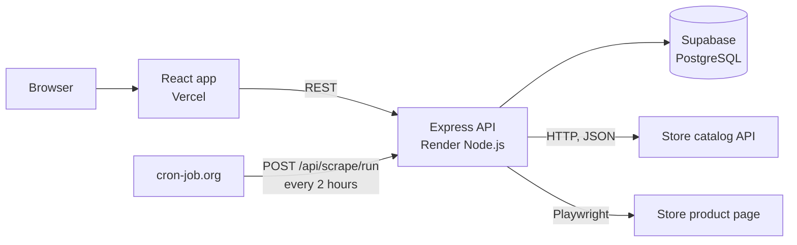

# INE Product Price Tracker

Search the INE demo store, pick a product, and watch its price and stock over time. A scraper checks every tracked product **once every 2 hours**, retries failures with exponential backoff, refuses to store any reading it cannot verify, and logs **every** attempt, including the ones that fail.

Built for the INE Software Engineer Intern assignment. Scraping reliability is the heart of it, so the reasoning lives in [**DESIGN_NOTE.md**](https://github.com/Vishuddhijain/-INE-Product-Price-Tracker/blob/main/docs/design-note.md)

## Submission links

|                      |                                                               |
| -------------------- | ------------------------------------------------------------- |
| Live site (Vercel)   | `https://ine-product-price-tracker.vercel.app`                |
| API (Render)         | `https://ine-product-price-tracker-znup.onrender.com`         |
| Source code          | `https://github.com/Vishuddhijain/-INE-Product-Price-Tracker` |
| Headed-run recording | TODO: link                                                    |
| Design note          | [DESIGN_NOTE.md](https://github.com/Vishuddhijain/-INE-Product-Price-Tracker/blob/main/docs/design-note.md)  |

## What it does

| Assignment requirement How it is met     |                                                                                                                                                                           |
| ---------------------------------------- | ------------------------------------------------------------------------------------------------------------------------------------------------------------------------- |
| Search the store by partial or full name | `GET /api/products/search` scans the store's whole catalog (up to 20 pages of 50) and matches name, brand and SKU. Pages are cached in memory for 60 s and de-duplicated. |
| Track a product                          | Saved to Supabase (`tracked_products`). Duplicates are rejected with a clear 409.                                                                                         |
| Scrape price and stock every 2 hours     | An external cron job calls `POST /api/scrape/run` every 2 hours (see [Scheduling](#scheduling)).                                                                          |
| Price and stock history                  | Per-product chart of price and stock quantity, plus a list of tracked products with their latest price and stock. Shows the latest 200 readings.                          |
| Per-product scrape log                   | Every attempt is listed with time, attempt number, outcome (`success`, `retried`, `failed`), price and detail. Failures are stored, never hidden.                         |
| Reliable unattended scraping             | Retries, backoff, per-attempt timeouts, validation before saving. See [How a scrape works](#how-a-scrape-works).                                                          |
| Observable (headed) run                  | `npm run scrape:once -- <url> --headed`. See [Headed run](#headed-run-for-the-recording).                                                                                 |

Also included: a **Scrape now** button per product, and automated tests of the scraper against a local mock of the storefront.

## Architecture



The frontend never talks to Supabase. Only the API holds the database key.

The scraper uses the lightest tool that is correct for each job:

- **Catalog search: plain HTTP.** The store exposes a JSON catalog, so no browser is needed.
- **Live price and stock: Playwright.** The price is hidden until a real pointer moves and dwells over the price block and "Reveal price" is clicked; the page then runs its own challenge and session requests. A plain HTTP fetch would only ever see "Price hidden".

## How a scrape works

For each tracked product, up to `SCRAPER_MAX_RETRIES` attempts (default 3), each in a **fresh browser context**:

1. Load the product page and wait for the price block.
2. Dismiss the cookie-consent modal if it is up (it blocks pointer events).
3. Move the pointer across the price block on a fixed path (12 moves, 700 ms dwell) until "Reveal price" enables.
4. Click it, and verify the click did something. If not, hover and click again.
5. Wait for the store's own `price-success` or `price-error` state.
6. Wait until the price has stopped being provisional (no "Updating…", fully opaque, unchanged for 700 ms).
7. Pick the sale price by meaning: visible, not `aria-hidden`, not struck through.
8. **Validate**: sane positive price, consistent with the MRP and the "% off" label, stock badge present.
9. Only then write to `price_history`, and log the attempt as `success`.

Any failure is logged as `retried` (an attempt remains) or `failed` (the last one), with the error code and a compact network summary such as `challenge[429,429,200] session[200] price[500,503,200] layout r627001/v0`. Retries wait 3 s, then 6 s (the delay doubles each time). Nothing is written to `price_history` unless validation passed.

## Repository layout

```
backend/
  src/
    server.js                     Express app, CORS, health check
    routes/  controllers/         HTTP layer
    services/
      scraper.service.js          the scraper (Playwright, retries, validation)
      product.service.js          catalog search + tracked products
      history.service.js          price_history and scrape_logs access
    lib/supabase.js               Supabase client (server-side key)
    utils/                        retry helper, input validation
frontend/
  src/
    App.jsx
    components/  SearchPanel.jsx · TrackedList.jsx · ProductDetail.jsx
    lib/api.js                    API client
docs/design-note.md

```

## Local setup

**Prerequisites:** Node.js 22 (LTS recommended), a Supabase project, and Playwright's Chromium.

### 1. Database

In the Supabase SQL editor, create the three tables the API reads and writes:

```sql
create table if not exists tracked_products (
  id            uuid primary key default gen_random_uuid(),
  product_name  text not null,
  product_url   text not null unique,
  image_url     text,
  active        boolean not null default true,
  created_at    timestamptz not null default now()
);

create table if not exists price_history (
  id                  bigint generated always as identity primary key,
  tracked_product_id  uuid not null references tracked_products(id) on delete cascade,
  price               numeric not null,
  stock_status        text not null,
  scraped_at          timestamptz not null default now()
);

create table if not exists scrape_logs (
  id                  bigint generated always as identity primary key,
  tracked_product_id  uuid not null references tracked_products(id) on delete cascade,
  attempt             int  not null default 1,
  status              text not null check (status in ('success', 'retried', 'failed')),
  message             text,
  price               numeric,
  stock_status        text,
  error               text,
  started_at          timestamptz,
  finished_at         timestamptz
);

create index if not exists price_history_product_time on price_history (tracked_product_id, scraped_at desc);
create index if not exists scrape_logs_product_time   on scrape_logs   (tracked_product_id, started_at desc);

```

`price` and `stock_status` are `NOT NULL` on purpose: a reading without them can never be stored.

### 2. Backend

```bash
cd backend
cp .env.example .env          # then fill in SUPABASE_URL and SUPABASE_SECRET_KEY
npm install
npx playwright install chromium
npm start                     # http://localhost:5000

```

Check it: `GET http://localhost:5000/api/health`.

### 3. Frontend

```bash
cd frontend
cp .env.example .env          # VITE_API_URL=http://localhost:5000
npm install
npm run dev                   # http://localhost:5173

```

### Environment variables

**Backend (\*\***`backend/.env`\***\*)**

| Variable Required Default Purpose     |     |                                  |                                                                                |
| ------------------------------------- | --- | -------------------------------- | ------------------------------------------------------------------------------ |
| `SUPABASE_URL`                        | yes |                                  | Supabase project URL.                                                          |
| `SUPABASE_SECRET_KEY`                 | yes |                                  | Server-side Supabase key. Never expose it to the frontend or commit it.        |
| `STORE_BASE_URL`                      | no  | `https://demo.inelabteamdev.com` | The only site the app will scrape. Product URLs on any other host are refused. |
| `PORT`                                | no  | `5000`                           | API port (Render sets this itself).                                            |
| `SCRAPER_TIMEOUT`                     | no  | `15000`                          | Per-step timeout in ms (element waits, click).                                 |
| `SCRAPER_MAX_RETRIES`                 | no  | `3`                              | Total attempts per scrape.                                                     |
| `SCRAPER_REVEAL_TIMEOUT`              | no  | `20000`                          | How long to wait for the store's own success/error state after the click.      |
| `SCRAPER_SETTLE_TIMEOUT`              | no  | `15000`                          | How long to wait for the price to stop being provisional.                      |
| `SCRAPER_BACKOFF_MS`                  | no  | `3000`                           | First retry delay; it doubles each attempt.                                    |
| `CRON_SECRET`                         | no  | unset                            | If set, `POST /api/scrape/run` requires the header `X-Cron-Secret: <value>`.   |
| `CATALOG_CACHE_TTL_MS`                | no  | `60000`                          | How long catalog pages are cached for search.                                  |
| `SCRAPER_NO_SANDBOX`                  | no  | `false`                          | Set to `true` in containers (Docker/Render).                                   |
| `SCRAPER_SLOW_MO_MS`                  | no  | `0`                              | Slows every browser action, useful when recording.                             |
| `SCRAPER_DEBUG_DIR`                   | no  | unset                            | If set, a failed attempt saves the price-block HTML and a screenshot there.    |
| `PLAYWRIGHT_CHROMIUM_EXECUTABLE_PATH` | no  | unset                            | Use a specific Chromium binary.                                                |

**Frontend (\*\***`frontend/.env`\***\*)**

| Variable Required Purpose |     |                                                |
| ------------------------- | --- | ---------------------------------------------- |
| `VITE_API_URL`            | yes | Base URL of the API, without a trailing slash. |

## API

| Method and path Purpose                       |                                                                                                                 |
| --------------------------------------------- | --------------------------------------------------------------------------------------------------------------- |
| `GET /api/health`                             | Liveness check (used by the keep-warm cron job).                                                                |
| `GET /api/products/search?q=&page=&pageSize=` | Search the store catalog. Omit `q` to browse page by page.                                                      |
| `GET /api/products/:id`                       | One catalog product.                                                                                            |
| `GET /api/tracked-products`                   | Active tracked products.                                                                                        |
| `POST /api/tracked-products`                  | Track a product. Body: `{ "name", "url", "imageUrl" }`.                                                         |
| `GET /api/tracked-products/:id/history`       | Price and stock readings (latest 200).                                                                          |
| `GET /api/tracked-products/:id/logs`          | Scrape attempts (latest 200).                                                                                   |
| `POST /api/tracked-products/:id/scrape`       | Scrape one product now and wait for the result.                                                                 |
| `POST /api/scrape/run`                        | Scheduled trigger. Returns `202` immediately and scrapes every active product in the background, one at a time. |

## Scheduling

Free Render instances sleep when idle, so nothing inside the app can be trusted to wake up on its own. The schedule lives in [cron-job.org](https://cron-job.org/), and the app does the work when called. Create two jobs after deploying:

| Job Request Schedule |                                                                                                     |                                   |
| -------------------- | --------------------------------------------------------------------------------------------------- | --------------------------------- |
| Scrape               | `POST https://<your-api>/api/scrape/run` (add header `X-Cron-Secret: <CRON_SECRET>` if you set one) | **Every 2 hours** (`0 */2 * * *`) |
| Keep warm            | `GET https://<your-api>/api/health`                                                                 | Every 10 minutes                  |

The scrape endpoint answers `202` straight away, because cron services give up on slow requests. It then works through all active products in the background. Only one scheduled run can be active at a time; a second call while one is running is acknowledged and ignored. The result of every attempt appears in each product's scrape log.

## Headed run for the recording

The scraper supports a headed Playwright mode so the browser interaction can be shown during the assignment recording.

For the recording, demonstrate:

- the product page loading;
- pointer interaction with the price block;
- the Reveal-price interaction;
- the price becoming available;
- validation before persistence;
- a slow or failed attempt followed by retry/backoff;
- the scrape log showing the outcome.

## Testing

Backend startup:

```bash
cd backend
npm start
```

Health check:

```text
GET http://localhost:5000/api/health
```

The key validation is the real scraper flow against the INE demo store, including pointer interaction, reveal handling, provisional-price protection, retries, timeouts, and failure logging.

After deployment, verify the Render API first and then verify that the Vercel frontend can reach it.

## Deployment

**Backend on Render.** The backend is deployed as a standard **Node.js Web Service** with root directory `backend`.

Build command:

```bash
npm install && npx playwright install chromium
```

Start command:

```bash
npm start
```

Required environment variables include `SUPABASE_URL`, `SUPABASE_SECRET_KEY`, and `STORE_BASE_URL`. `CRON_SECRET` can be configured when the scheduled endpoint is protected.

Health check path:

```text
/api/health
```

**Frontend on Vercel.** Import the repository, set the root directory to `frontend`, use the Vite preset, and set `VITE_API_URL` to the Render backend URL.

**Cron:** create the scheduled jobs described in [Scheduling](#scheduling).

**No Docker is used in this project.**

CORS is currently open (`cors()` with defaults), which is fine for a public demo API with no user accounts.

## Known limitations

- **The store is deliberately unreliable.** Some attempts fail because the store rate-limits (429), errors (500/503), or never finishes loading. Those show up as `retried`/`failed` in the log, and the chart has a gap rather than a made-up point.
- **Scraping is sequential** with one shared browser. That is slower than parallel but is gentler on a small free instance and on the store's rate limits.
- **"Scrape now" waits for the result.** A normal scrape takes a few seconds after the page loads, but with retries and timeouts a bad case can take a couple of minutes.
- **Assumptions baked into the page reading:** amounts are in rupees; the consent modal has a button labelled "Accept"; two layout variants (`v0`, `v2`) have been seen. A layout the scraper doesn't recognise fails as `STRUCTURE_CHANGED` instead of being guessed at.
- **Not built:** removing a tracked product, price-drop or back-in-stock alerts, per-product scrape frequency, CI/CD. The API has no user authentication beyond the optional cron secret.
