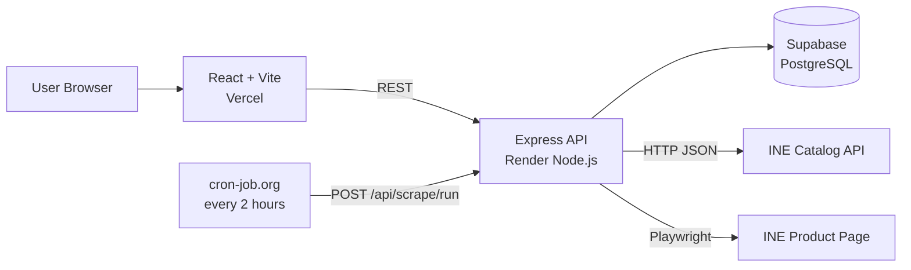

# INE Product Price Tracker

> A reliability-first price and stock tracker for the INE hosted mock store.

[Live demo](https://ine-product-price-tracker.vercel.app) · [Backend API](https://ine-product-price-tracker-znup.onrender.com) · [GitHub](https://github.com/Vishuddhijain/-INE-Product-Price-Tracker) · [Design note](docs/design-note.md)

Built for the **INE Software Engineer Intern assignment**. The project deliberately puts the engineering effort into the difficult part of the task: **reliable unattended scraping**, not just the UI.

## Why this project is different

The INE store does not expose the final price as a simple static HTML value. The price is gated behind real pointer interaction, asynchronous client-side work, transient failures, and misleading DOM values.

The implementation therefore uses a hybrid strategy:

- **HTTP + JSON** for catalog search, where a browser is unnecessary.
- **Playwright** only for the product page, where real browser interaction is required.
- **Validation before persistence** so a doubtful price becomes a logged failure, not a bad history point.
- **Retries with exponential backoff** and a fresh browser context per attempt.
- **External scheduling** every 2 hours through cron-job.org because the Render free tier can sleep.

## What is implemented

| Capability                  | Implementation                                                               |
| --------------------------- | ---------------------------------------------------------------------------- |
| Product search              | Partial/full search across the catalog, matching name, brand and SKU         |
| Tracking                    | Products persisted in Supabase; duplicate tracking returns `409`             |
| Untracking                  | `DELETE /api/tracked-products/:id`; UI supports Track/Untrack                |
| Price + stock scraping      | Playwright with deterministic hover/reveal handling                          |
| Reliability                 | Retries, timeouts, exponential backoff and fresh browser context per attempt |
| Correctness                 | Semantic price selection + MRP/discount consistency + stock validation       |
| Honest history              | `price_history` is written only after successful validation                  |
| Scrape log                  | Every attempt recorded as `success`, `retried` or `failed`                   |
| Scheduled scraping          | External cron job every 2 hours; endpoint returns `202` immediately          |
| Price-drop indicator        | In-app comparison against the previous successful history point              |
| Back-in-stock indicator     | In-app comparison of the latest two stock states                             |
| Structure-change protection | Unexpected price structure fails as `STRUCTURE_CHANGED` instead of guessing  |
| Headed mode                 | `scripts/scrape-once.js` supports visible browser runs for the recording     |

## Assignment coverage

The core requirements are implemented as follows:

| Requirement                 | How it is handled                                                                                    |
| --------------------------- | ---------------------------------------------------------------------------------------------------- |
| Search by partial/full name | `GET /api/products/search` scans catalog pages sequentially with caching, spacing and de-duplication |
| Pick and track a product    | Stored in Supabase `tracked_products`                                                                |
| Scrape every 2 hours        | `cron-job.org` calls `POST /api/scrape/run` every 2 hours                                            |
| Price + stock history       | Per-product chart from `price_history`                                                               |
| Per-attempt scrape log      | Per-product `scrape_logs` with timestamp, attempt, status, price and error/detail                    |
| Slow/failing responses      | Retry/backoff + store-state waiting + per-attempt timeout                                            |
| Wrong/empty data protection | Price is validated before `price_history` is written                                                 |
| Free-tier scheduling        | External cron, with the scheduled endpoint returning `202 Accepted` immediately                      |
| Headed run                  | Production scraper can be run visibly with `scripts/scrape-once.js`                                  |

## Architecture



The frontend never talks directly to Supabase. The server-side API owns the database credentials.

## Scraping flow

For each tracked product, the production scraper can make up to `SCRAPER_MAX_RETRIES` attempts (default `3`), using a fresh Playwright context for each attempt:

1. Load the product page and wait for `.price-block`.
2. Attempt to dismiss the cookie-consent overlay.
3. Move the pointer across the price block until **Reveal price** becomes enabled.
4. Click Reveal and verify that the store actually starts doing work.
5. Wait for the store's own `price-success` or `price-error` state.
6. Wait for the displayed price to stop being provisional.
7. Select the sale price semantically: visible, not `aria-hidden`, not struck through.
8. Validate price, MRP/discount consistency and stock.
9. Only then write to `price_history` and record a successful attempt.

A failed attempt is logged and retried; the final failure is logged without writing a price-history row.

## Reliability decisions

### 1. Deterministic pointer interaction

The store's Reveal button is hover-gated. The scraper uses a fixed pointer path, multiple sweeps and a dwell instead of relying on a simple `hover()` call.

### 2. Semantic price extraction

The scraper does not assume the first currency value is correct. It rejects hidden/`aria-hidden` values and struck-through MRP values, then requires exactly one visible non-struck sale price.

### 3. Provisional-price protection

A `price-success` state is not treated as sufficient by itself. The scraper waits for the `"Updating…"` state to disappear, requires the value to be fully opaque, and requires the reading to remain unchanged for a stability window.

### 4. Validation before persistence

The price must be sane and consistent with the MRP and discount label. A visible stock badge is also required. If validation fails, the attempt is logged and no `price_history` point is created.

### 5. Fresh attempts

Each retry receives a fresh browser context. Backoff is exponential (`3s`, then `6s`, then `12s` if another retry is needed).

### 6. Free-tier scheduling

The scheduled endpoint returns `202 Accepted` immediately and performs the scrape in the background. A small in-memory guard prevents overlapping scheduled runs within the same running instance.

## Reliability evidence

A successful production run can legitimately look like:

```text
Attempt #2  RETRY  [HOVER_GATE] ...
Attempt #3  OK     ₹16,943 / stock "Selling fast – 18 left..."
```

That is intentional: a transient failure should be visible in the log, followed by a clean retry, rather than being hidden.

## Bonus features included

### Price-drop indicator

The UI compares the two newest successful history points and shows the absolute and percentage drop when the current price is lower.

### Back-in-stock indicator

The UI identifies a transition from an out-of-stock status to an available status using the latest two history points.

### Multi-product tracking

The tracked-products view displays multiple tracked products together with their latest price/stock state.

### Structure-change protection

If the expected semantic price structure is missing or ambiguous, the scraper fails with `STRUCTURE_CHANGED` instead of saving a guessed value.

## Repository layout

```text
backend/
  src/
    server.js
    routes/
      products.routes.js
      tracking.routes.js
      scrape.routes.js
    controllers/
      products.controller.js
      tracking.controller.js
      scrape.controller.js
    services/
      product.service.js
      scraper.service.js
      history.service.js
    lib/
      supabase.js
    utils/
      retry.js
      validation.js
  scripts/
    scrape-once.js
    probe-reveal.js
    probe-price-dom.js
  package.json
  package-lock.json

frontend/
  src/
    App.jsx
    components/
      SearchPanel.jsx
      TrackedList.jsx
      ProductDetail.jsx
    lib/
      api.js
      indicators.js
  public/
  package.json
  package-lock.json
  vite.config.js

docs/
  design-note.md

README.md
.gitignore
```

The probe scripts are investigation/diagnostic utilities; they are not required by the production runtime.

## Local setup

### Prerequisites

- Node.js
- Supabase project
- Chromium installed through Playwright

### Backend

```bash
cd backend
npm install
npx playwright install chromium
npm start
```

Health check:

```text
GET http://localhost:5000/api/health
```

### Frontend

```bash
cd frontend
npm install
npm run dev
```

Set:

```text
VITE_API_URL=http://localhost:5000
```

## Environment variables

### Backend

| Variable                              | Required | Purpose                                                   |
| ------------------------------------- | -------- | --------------------------------------------------------- |
| `SUPABASE_URL`                        | Yes      | Supabase project URL                                      |
| `SUPABASE_SECRET_KEY`                 | Yes      | Server-side Supabase key; never expose it to the frontend |
| `STORE_BASE_URL`                      | No       | Defaults to `https://demo.inelabteamdev.com`              |
| `PORT`                                | No       | Render supplies the runtime port                          |
| `SCRAPER_TIMEOUT`                     | No       | Per-step Playwright timeout in milliseconds               |
| `SCRAPER_MAX_RETRIES`                 | No       | Total scrape attempts; default `3`                        |
| `SCRAPER_REVEAL_TIMEOUT`              | No       | Maximum wait for the store's reveal state                 |
| `SCRAPER_SETTLE_TIMEOUT`              | No       | Maximum wait for a provisional price to settle            |
| `SCRAPER_BACKOFF_MS`                  | No       | Initial retry delay; doubled on each retry                |
| `CATALOG_CACHE_TTL_MS`                | No       | Catalog page cache lifetime                               |
| `SCRAPER_SLOW_MO_MS`                  | No       | Optional browser slowdown for headed demonstrations       |
| `SCRAPER_DEBUG_DIR`                   | No       | Optional directory for failed-attempt HTML/screenshots    |
| `PLAYWRIGHT_CHROMIUM_EXECUTABLE_PATH` | No       | Optional explicit Chromium executable                     |

### Frontend

```text
VITE_API_URL=<Render backend URL>
```

## API

| Method   | Endpoint                            | Purpose                                              |
| -------- | ----------------------------------- | ---------------------------------------------------- |
| `GET`    | `/api/health`                       | Liveness check                                       |
| `GET`    | `/api/products/search?q=...`        | Search the catalog                                   |
| `GET`    | `/api/products/:id`                 | Read one catalog product                             |
| `GET`    | `/api/tracked-products`             | List active tracked products                         |
| `POST`   | `/api/tracked-products`             | Track a product                                      |
| `DELETE` | `/api/tracked-products/:id`         | Untrack a product                                    |
| `GET`    | `/api/tracked-products/:id/history` | Read price/stock history                             |
| `GET`    | `/api/tracked-products/:id/logs`    | Read scrape attempts                                 |
| `POST`   | `/api/tracked-products/:id/scrape`  | Manually scrape one tracked product                  |
| `POST`   | `/api/scrape/run`                   | Start a scheduled background scrape and return `202` |

## Scheduling

The deployed scheduled job is:

```text
POST https://ine-product-price-tracker-znup.onrender.com/api/scrape/run
```

Cron expression:

```text
0 */2 * * *
```

That means **once every 2 hours**.

Because the Render free instance can sleep, the external scheduler is responsible for waking the service and triggering the scrape. The scheduled endpoint responds immediately and performs the scrape in the background.

## Headed run

For the assignment recording, run the production scraper against one product without writing to Supabase:

```bash
cd backend
node scripts/scrape-once.js https://demo.inelabteamdev.com/product/109 --headed
```

Useful recording options:

```text
--simulate-failure   abort the first page load to demonstrate retry/backoff
--simulate-slow      delay /api/session responses to demonstrate slow-response handling
--debug              save failed-attempt HTML and screenshots
```

## Deployment

### Backend — Render

- Runtime: **Node.js**
- Root directory: `backend`
- Build command:

```bash
npm run render-build
```

- Start command:

```bash
npm start
```

The `render-build` script installs the Playwright Chromium browser for the deployed service.

### Frontend — Vercel

- Root directory: `frontend`
- Framework: Vite
- Environment variable:

```text
VITE_API_URL=https://ine-product-price-tracker-znup.onrender.com
```

### Database — Supabase

Supabase stores:

- `tracked_products`
- `price_history`
- `scrape_logs`

## Known limitations

- The mock store is intentionally unreliable; transient 429/500/503 responses can still occur.
- Scraping is sequential to reduce pressure on the small free-tier backend and the target store.
- Manual `Scrape now` waits for the result, while scheduled scrapes return `202` immediately and continue in the background.
- The scraper intentionally fails closed when the expected DOM structure is ambiguous rather than guessing.

## Submission links

| Item             | Link                                                        |
| ---------------- | ----------------------------------------------------------- |
| Live site        | https://ine-product-price-tracker.vercel.app                |
| Render API       | https://ine-product-price-tracker-znup.onrender.com         |
| GitHub           | https://github.com/Vishuddhijain/-INE-Product-Price-Tracker |
| Design note      | [docs/design-note.md](docs/design-note.md)                  |
